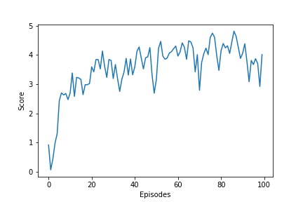

## Report "Collaboration and competition"

### Learning algorithm (ppo_agent.py file)

- Preliminary functions :

  > The first two functions are used for computing both advantages and expected discounted returns needed in learning process. In the first one, we stock (line 16) the TD-residuals (computed at each state of the trajectory) of the set of state values "VALUES" and with discount gamma, using the formula described in the "HIGH-DIMENSIONAL CONTINUOUS CONTROL USING GENERALIZED ADVANTAGE ESTIMATION " search paper (section 'Preliminaries' equation n°6). In the second one, we used these TD-residuals values for computing (lines 27, 28, 29) the generalized advantage estimator GAE(gamma, lamda) at each time step, as described in the same paper (equations n°11,....,n°14), along with the discounted returns. After having stored all these values in tensors for futures calculations, we normalize the advantage values to prevent the values from getting too large (it make the values independent from the length of the trajectory, allowing a better learning from the agent when computing the surrogate loss).
  > The next function `get_log_probs` outputs a tensor containing the logarithm of the probability corresponding to each actions ( view here as random variables) performed throughout the trajectories. It will be used to compute the surrogate loss. Here instead of directly applying the log function to the whole formula of the probability density of a normal distribution, we are using the mathematical property of log that turns product into sum (this way the expression to be computed is dramatically simplified).
  > The following function will be used for collecting the trajectory. Here we are using the policy model of the agent to output the actions needed to be performed when being in the visited states.
  > The last function creates the two trajectories ( one for each agent) on which we are going to run our analysis during the learning process. Notice here that the function outputs the `results`list in which these trajectories are stored as tuples of tensors (each tuple corresponds to one single agent and will allow us to perform both learnings one after the other).

- "Agent" class :

  > The first attributes are some hyper-parameters that we store as class attributes just to simplify the implementation in the calculation phase (see "perform_ learning_with( )" method). 
  > The next two attributes are the policy model (outputs the best distributions for choosing the right actions (each of them consisting in four numbers corresponding to torque applicable to two joints) to performed and the critic model (outputs state value of each given state). Then we create the optimizers that will update the parameters at the very end of training using the gradient computed with the backward() method.
  > ​        The following part of the code is about the learning process. The set of experiences (buffer) is split into batches randomly generated (line 102) at each epoch. Then we extract the sub-sets that we need (lines 106-110) to get our two losses, namely advantages (line 108) + old/new policies(lines 114, 115) for surrogate loss (line 122), and returns (line 109) + old/new values(lines 110,124) for critic loss (line 130). Finally, we need to compute the gradient of the loss functions through the backward method (that propagates the error of total_loss through the entire network and computes derivatives with respect to each parameter of the model). Notice that we can combine the losses (line 132) without risking any problem because our two models (policy and critic) don't share any common parameters (that allows us to use only one computational graph which have however to be retained for enabling the second back-propagation): that way each optimizer can update only its corresponding parameters without affecting the others when calling backward() on total_loss.   

### Performance

> The environment have been solved in 100 episodes. At that point, my agent gets an average score of 3.57 (mean over last 100 episodes) . 
>
>        
>
> - Future ideas for improvement 
>
>   > When I take a look at the plot displaying the evolution of performance, I notice that despite some good progression at the very beginning of training,  the performance does not evolve much from approximatively episode 30 up to the end. The reason for that may come from a bad choice of learning rate that should be set to a lower value. Indeed although a high value allows us to quickly reach a local optimum of the surrogate loss function (resulting in a quite rapid learning from the agents) , it increases the risk of overshooting better local optimums (global optimum being the most important in order to maximize learning), keeping learning from improving and the scores from constantly increasing. 
>   >
>   > I think that a lower value of learning rate would result in a more stable learning following the first ten episodes. 